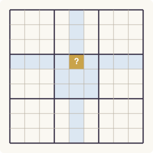
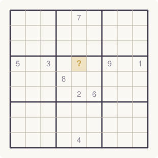
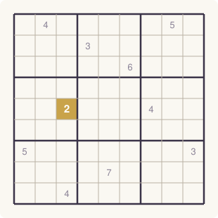
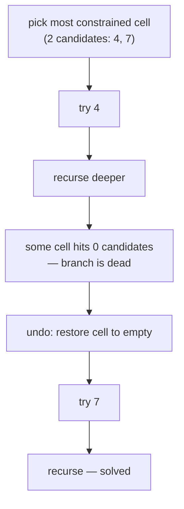

# SudokuSolver

A sudoku solver I wrote in a day when I first learned to code, because the
rules were clear and it seemed like a good build. Years later I learned that
what I'd converged on has names: **backtracking search over a constraint
graph with minimum-remaining-values ordering** — the textbook approach to
constraint satisfaction problems. I hadn't read the textbook. The problem
just said "start with the most constrained cell," so I did.

**Provenance, stated plainly:** the solver is handwritten, 2023, unassisted.
The test suite, benchmarks, diagrams, and this documentation were produced in
2026 with my AI tooling — the code got the full audit treatment years after
it was written, and passed. Handwritten code, AI-verified. I like the
combination enough to label it.

## Live demo

**[Try it in your browser](https://sebastiankane.github.io/SudokuSolver/)** —
the page loads the actual `SudokuSolver.py` into a WebAssembly Python
(Pyodide) and runs it on whatever grid you enter. Not a JavaScript port: the
handwritten 2023 file itself, unmodified (a test enforces that the demo's
copy never drifts from the source). Presets include Inkala 2010, the
"world's hardest sudoku" — watch it fall in about a tenth of a second.

## How it works

The whole solver is ~150 lines and four ideas.

### 1 · The grid is a constraint graph



*Every cell holds live references to its 20 peers — its row, its column, and
its 3×3 box.* There is no scanning to find a cell's constraints at solve
time; each `Cell` object is constructed knowing exactly which other cells
constrain it. Representation chosen to serve the query.

### 2 · A cell's options are computed by subtraction



*domain(cell) = {1..9} − row values − column values − box values.* One set
subtraction (`possible_values()`) and a cell knows everything it may legally
be. If the result is empty, this branch of the search is already dead — see
idea 4.

### 3 · The most constrained cell speaks first (MRV)



*The numbers show how many values each empty cell still allows; the solver
always fills the smallest first.* This is the minimum-remaining-values
heuristic, and it is the entire reason this solver is fast: if some cell is
about to be impossible, MRV finds out **now**, before effort is wasted
elsewhere — and a cell with one candidate is not a guess at all. Naive
solvers scan top-left to bottom-right and discover contradictions late;
`find_fewest()` walks straight toward the fire.

### 4 · Backtracking with honest undo



Try a value, recurse; on contradiction, restore the cell and try the next.
`find_fewest()` also short-circuits the moment any cell reports zero
candidates, so dead branches die at first contact instead of after deep
exploration. The recursion bottoms out when no `0` remains — the solved grid.

## Benchmarks

Measured on a modest desktop CPU; every solution validated by an independent
checker (rows, columns, boxes verified against the rules, not against the
solver).

| Puzzle | Time |
|---|---|
| Typical puzzle | 3.5 ms |
| 17-clue minimal (sparsest legal sudoku) | 137 ms |
| Inkala 2010 ("world's hardest sudoku") | 123 ms |
| Al Escargot | 17 ms |
| Empty grid | 8 ms |
| Contradictory input | rejected in 2 ms |

Throughput: ~290 typical puzzles/second, single-threaded, standard library
only.

## Use

```python
from SudokuTools import SudokuSolver as st

p = st.Puzzle()
p.load_puzzle("530070000600195000098000060800060003"
              "400803001700020006060000280000419005000080079")
print(p.solve())   # 9-line solution string, or None if unsolvable
```

Puzzles are 81-character strings, read left to right, top to bottom, `0` for
empty.

## Tests

```
pip install pytest
pytest
```

The suite solves the benchmark set above, validates every solution
independently, asserts the original clues survive untouched, and confirms
contradictory input returns `None` rather than a wrong grid. The diagrams
regenerate with `python docs/make_diagrams.py`.

## What it does NOT do

- No puzzle **generation** — solving only. (An earlier version of this
  repo's description said otherwise; this README corrects the record.)
- No uniqueness checking: a puzzle with multiple solutions returns the first
  found, without a warning.
- No difficulty rating, no hints, no step-by-step explanation.
- One historical quirk, preserved honestly: the internal `row`/`column`
  names are swapped relative to convention (harmless — the constraints are
  symmetric — but noted so nobody trips on it reading the source).

## Why it's still here

Because it's the first thing I built that later turned out to be *correct in
the literature's terms* without the literature's help, and I'd rather keep
the evidence than polish the history.

## Credits

Handwritten solver: **Sebastian Kane**, 2023. Test suite, benchmarks,
diagrams, and documentation: AI-assisted, human-directed, 2026 — nothing
ships until the tests pass and a human has read the diff.
